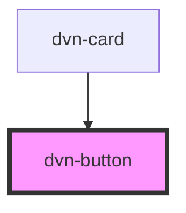

# dvn-button

<!-- Auto Generated Below -->

## Properties

| Property   | Attribute  | Description                                                            | Type                               | Default     |
| ---------- | ---------- | ---------------------------------------------------------------------- | ---------------------------------- | ----------- |
| `disabled` | `disabled` | Determines if a button is disabled or not                              | `boolean`                          | `false`     |
| `fill`     | `fill`     | Determines the buttons fill type. Default is `filled`                  | `"clear" \| "filled" \| "outline"` | `"filled"`  |
| `loading`  | `loading`  | Determines if the button is disabled because something is loading      | `boolean`                          | `false`     |
| `position` | `position` | Determines if it's a raised button or flat button. Default is `raised` | `"flat" \| "raised"`               | `"raised"`  |
| `shape`    | `shape`    | Determines if a button has rounded edges. Default is `default`         | `"default" \| "round"`             | `"default"` |
| `size`     | `size`     | Determines the size of the button. Default is `default`                | `"default" \| "large" \| "small"`  | `"default"` |
| `type`     | `type`     | Determines the button type. Default is `button`                        | `"button" \| "reset" \| "submit"`  | `"button"`  |

## Events

| Event         | Description                                                                                                                                                                                                     | Type                      |
| ------------- | --------------------------------------------------------------------------------------------------------------------------------------------------------------------------------------------------------------- | ------------------------- |
| `divBtnClick` | Emits when the button is clicked. The event is only emmitted if the button type is set to `button`. Otherwise, it either resets or submits if used inside a form and type is set to either `submit` or  `reset` | `CustomEvent<MouseEvent>` |

## Methods

### `toggleDisabled() => Promise<void>`

This toggles the disabled state

#### Returns

Type: `Promise<void>`

### `toggleLoading() => Promise<void>`

This toggles the loading state

#### Returns

Type: `Promise<void>`

## Dependencies

### Used by

 - [dvn-card](..\dvn-card)

### Graph

----------------------------------------------

*Built with [StencilJS](https://stenciljs.com/)*
